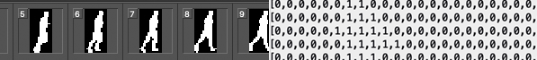

# 2-Bit Video Processor

Convert video image sequences into raw data files for use with 2-bit displays.



## What is it?
This is a small program to convert a video image sequence into a raw data file for use with 2bit displays such as [FlipDots](https://github.com/owenmcateer/FlipDots). 2-Bit means two single colours or on/off, no grayscale and alpha.

The program can rotate the video for you and also gives a nice verbose output as it processes your video.

Outputted files are uncompressed RAW data so they can be send directly to these 2bit displays using [Cast Canvas](https://github.com/owenmcateer/canvas-cast) or directly in code for Arduino or whatever display controller you may be using.  
Even short, small videos can result in large data files so be warned.

## Usage: 
`node 2bitVideoProcessor.js -d seq -o MyVideo`

### Options
```
-d, --dir             Directory image sequence
-f, --format [value]  Image sequence file format (defaults to ( "png")
-h, --help            Output usage information
-o, --output          Output file name
-r, --rotate <n>      Rotate video (defaults to 0)
-t, --threshold <n>   Black/white threshold range[0-255] (defaults to 127)
-v, --version         Output the version number
```

## Example


This [Image sequence](./demo-sequence/) becomes [Running.json](./demo-output/Running.json) by running:  
`node 2bitVideoProcessor.js -d demo-sequence/ -o demo-output/Running`

See the result in action on a [FlipDot display](https://github.com/owenmcateer/FlipDots).